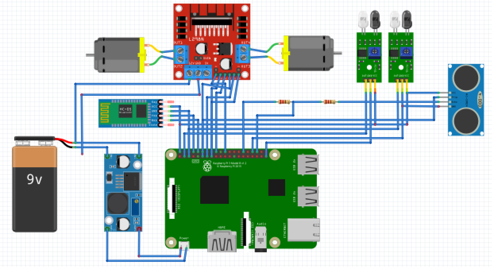
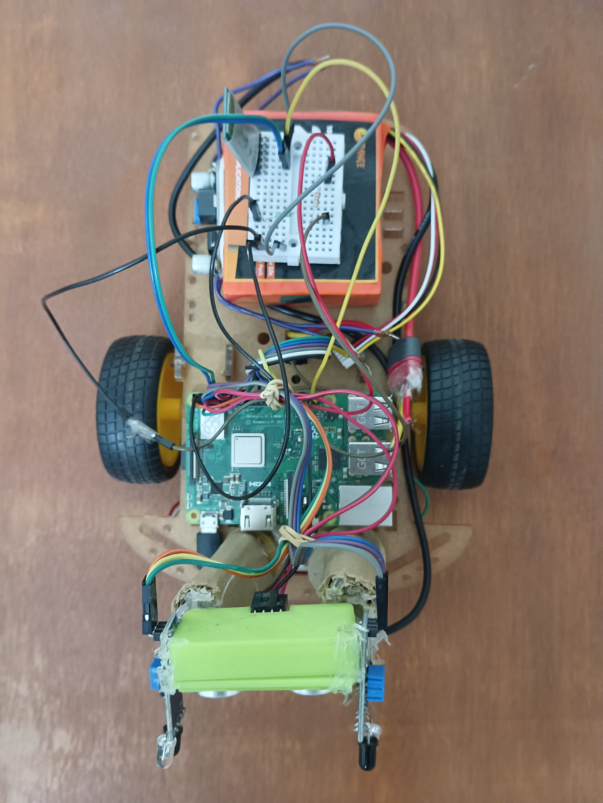
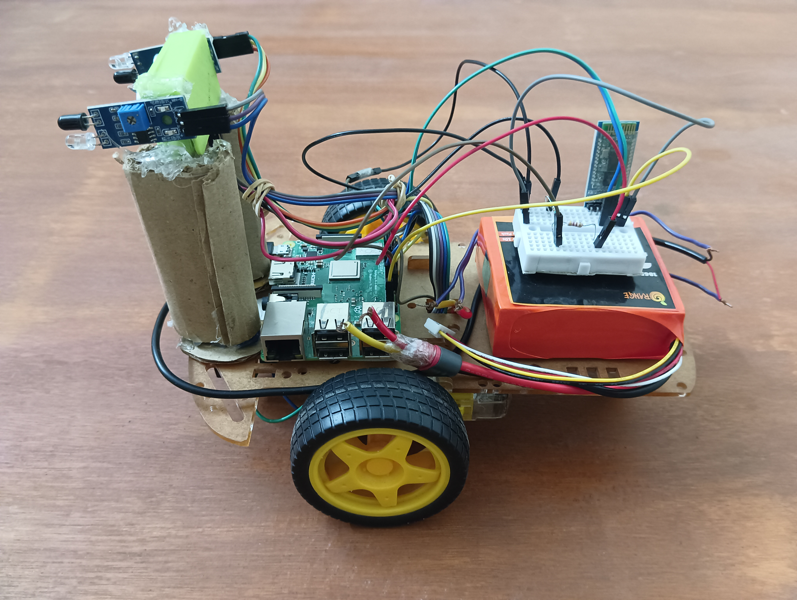

# Voice-Controlled as well as Object following Robot
Droid which is capable of moving around as per the directional instructions provided to it.

It operates on two types of inputs provided -
- Voice Commands provided by the user via Bluetooth.
- Object Following detection using ultrasonic sensor and IR sensors.

### Components Used
- Raspberry Pi
- Bluetooth Module 
- 11.6V Li-Po Battery
- Buck Converter
- Motor Driver L298N
- Dc Motors
- Ultrasonic Sensor
- IR Sensor

## Circuit Diagram

## Bot Images
  

